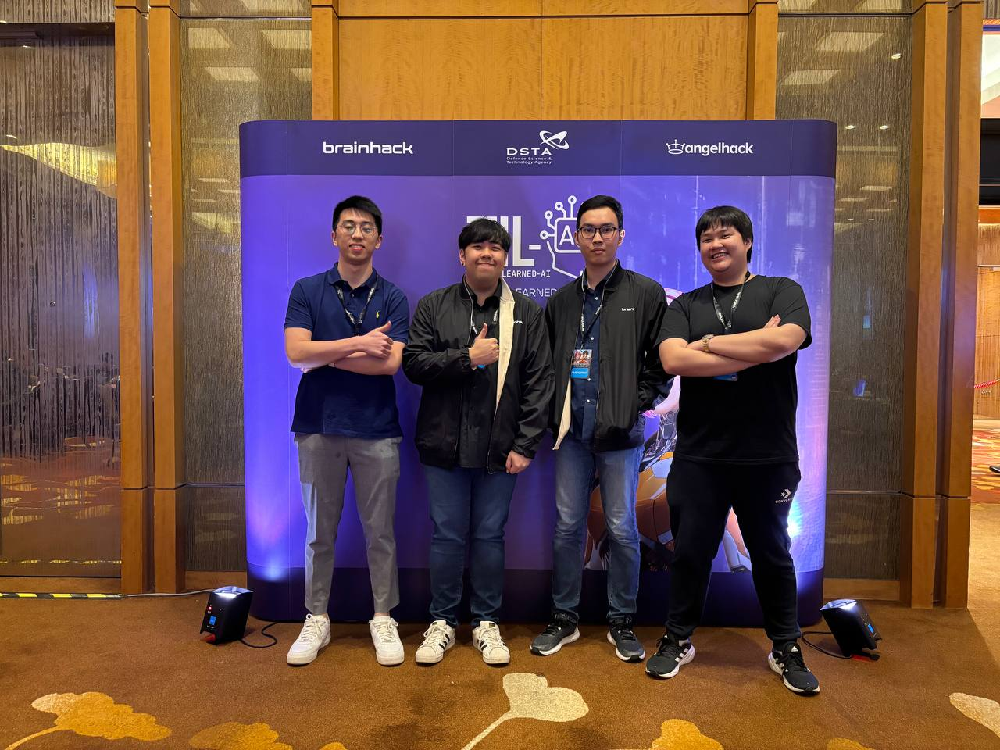

# TIL-AI-2024_freeicemilo

<p align="center">
    
</p>

<!-- Turret Demo Video -->
https://github.com/IlyasYao/TIL-AI-2024_freeicemilo/assets/27739101/4d3589f4-bc80-422f-8188-c0f88db130ef

## File Structure

In this repository, the codebase is divided into two segments:

-   Final AI Codes
    -   The FINAL code used in semi-finals and finals
-   Training Codes
    -   The codes used for starting out / training our models

## Requirements

1. Docker
2. Python
    - Anaconda
    - Jupyter Notebook
3. A good computer
    - Enough to train the models

## Final AI Codes (About)

This is the setup used to demo run locally. It is only meant for demo purposes, NOT evaluating the models.

This demo utilizes technologies like `Docker`, `Websocket`, and `RESTful API` to integrate everything seamlessly.

### Final AI Codes (How to)

Before continuing, please note, `til-competition` is the local testing environment provided. It is only meant for demo purposes, NOT evaluating the models.

1. Navigate to `ASR`, `NLP`, and `VLM`

    - Ensure the models are added inside (Upload of models are too large for GitHub)
    - For each `Manager.py`, ensure the models are connected correctly

2. Using docker, navigate to `Final AI Codes` directory and have docker installed.

    - To run: `docker compose up`
    - To restart: `docker compose down`

**During full local run:**

1. Run in terminal `docker compose up` to create the image and run the containers
2. In docker GUI, navigate to containers and ensure that every container is running, except `til-main`
3. For `til-competition`, open `localhost:8000` on a web browser to initiate a websocket connection
4. Run the `til-main` container and wait for the connection to succeed
5. The web browser and terminals should be responding correctly if successful

https://github.com/IlyasYao/TIL-AI-2024_freeicemilo/assets/27739101/901edad0-ea11-45d7-b72a-47b616005ded

**For individual local run:**

1. `docker run` the desired AI image
2. Use the correct `test.py` file

-   Docker commands

    -   port_no refer to Dockerfile
    -   task refer to asr/nlp/vlm
    -   docker ps to get the container_id

```bash
docker build -t freeicemilo-<task> .
docker run -p <port_no>:<port_no> -d freeicemilo-<task>
docker ps
docker kill <container_id>
```

## Final AI Codes (Each Image)

There are 6 images:

1. `ASR` - Converting audio file into text
    - [OpenAI Whisper](https://openai.com/index/whisper/)
2. `NLP` - Translating text into meaningful data
    - [BERT Model](https://huggingface.co/docs/transformers/en/model_doc/bert)
3. `VLM` - Converting data into locations of targets
    - [Ultralytics Realtime Detection Transformer (RT-DETR)](https://docs.ultralytics.com/models/rtdetr/)
        - Object detection
    - [OpenAI Clip Large Patch 14](https://huggingface.co/openai/clip-vit-large-patch14)
        - Zero-shot image classification
4. `autonomy` - Robot movement (Turret rotation)
    - [Python Robomaster](https://robomaster-dev.readthedocs.io/en/latest/introduction.html)
5. `main` - The orchestrator (ASR to NLP to autonomy to VLM)
    - Websocket
    - RESTful API
6. `competition` - The simulator environment

## Training Codes

## Additional References and Resources

1.  [BrainHack 2024 TIL-AI Guardian's Handbook](https://tribegroup.notion.site/BrainHack-2024-TIL-AI-Guardian-s-Handbook-c5d4ec3c3bd04b0db0329884c220791f) (Notion)
2.  [Qualifiers Leaderboard](https://airtable.com/appeN9J5OcPmfLzgf/shraBC7z4ZCYss9LD) (Airtable)
3.  [Learning Resources & Workshops](https://drive.google.com/drive/folders/1JmeEwQZoqobPmUeSZWrvR5Inrw6NJ8Kr) (Google Drive)
4.  [Learning Resources & Workshops](https://github.com/TIL-24/til-24-curriculum/) (GitHub)
5.  [Vertex AIWorkbench Environment](https://console.cloud.google.com/vertex-ai/workbench/instances?project=dsta-angelhack) (GCP Vertex AI)
6.  [til-24-base Starting Code](https://github.com/TIL-24/til-24-base/) (GitHub)
7.  [DSTA BrainHack Website](https://www.dstabrainhack.com/showcase-programme)
